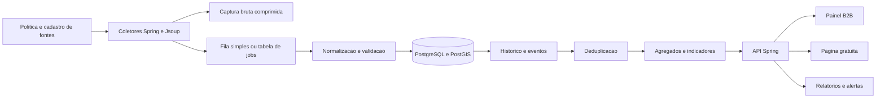
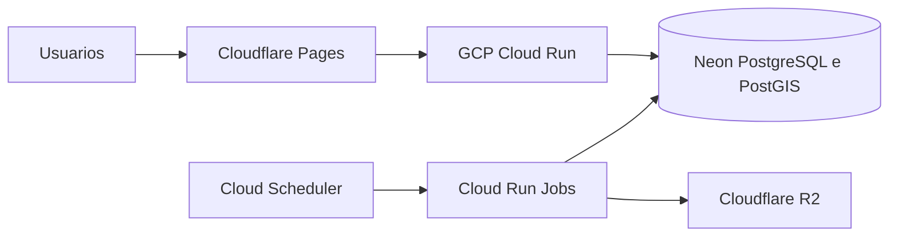
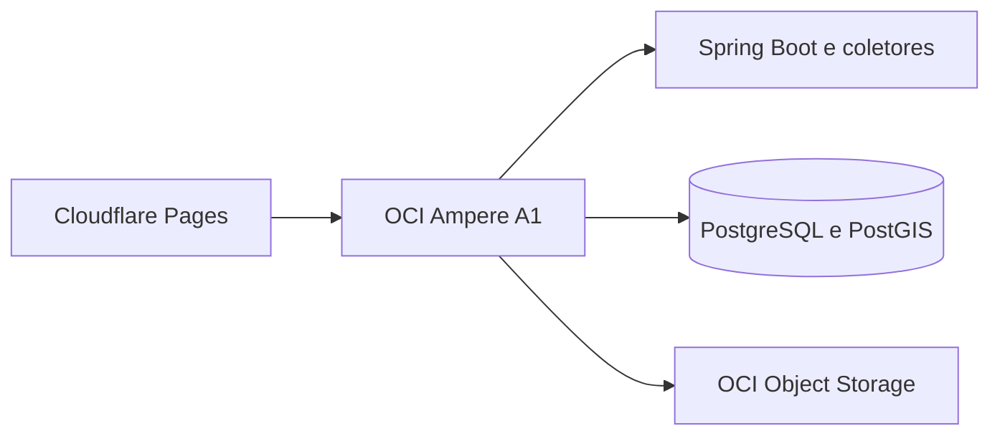

# Plano de Produto e Arquitetura - Inteligencia Imobiliaria Regional

> Versao do planejamento: 18/08/2026  
> Status: proposta para validacao comercial e tecnica

## Sumario

1. [Resumo executivo](#resumo-executivo)
2. [Problema e oportunidade](#problema-e-oportunidade)
3. [Publicos e propostas de valor](#publicos-e-propostas-de-valor)
4. [Modelos de receita](#modelos-de-receita)
5. [Estrategia de validacao](#estrategia-de-validacao)
6. [Arquitetura do MVP](#arquitetura-do-mvp)
7. [Stack recomendada](#stack-recomendada)
8. [Evolucao do projeto atual](#evolucao-do-projeto-atual)
9. [Modelo de dados](#modelo-de-dados)
10. [Coleta, historico e deduplicacao](#coleta-historico-e-deduplicacao)
11. [Hospedagem](#hospedagem)
12. [Custos e complexidade](#custos-e-complexidade)
13. [Evolucao para analytics e ML](#evolucao-para-analytics-e-ml)
14. [Qualidade, observabilidade e testes](#qualidade-observabilidade-e-testes)
15. [Riscos juridicos e operacionais](#riscos-juridicos-e-operacionais)
16. [Roadmap](#roadmap)
17. [Criterios de sucesso](#criterios-de-sucesso)
18. [Decisoes e itens adiados](#decisoes-e-itens-adiados)

## Resumo executivo

O projeto deve evoluir de um agregador que apaga e recarrega anuncios para uma plataforma regional de **inteligencia sobre ofertas imobiliarias**.

O diferencial nao deve ser apenas listar imoveis. Portais nacionais ja possuem maior inventario, trafego, marca e investimento. O ativo defensavel e o historico regional confiavel:

- evolucao do preco pedido;
- dias observados em oferta;
- anuncios novos, removidos e reativados;
- reducoes de preco;
- estoque aparente por bairro e tipologia;
- mediana e percentis de preco pedido por metro quadrado;
- deduplicacao entre imobiliarias e portais;
- comparacao de um imovel com ofertas semelhantes;
- rastreabilidade da origem e da qualidade de cada informacao.

A estrategia recomendada e validar primeiro um produto B2B assistido, com relatorios e estudos pagos. A pagina gratuita funciona como canal de aquisicao. Publicidade, leads, API comercial e ML entram apenas depois de qualidade, demanda e receita recorrente.

A arquitetura inicial deve continuar baseada em Java, Spring, Jsoup e PostgreSQL. O projeto nao precisa de Kafka, Spark, Elasticsearch ou um lakehouse completo no MVP.

## Problema e oportunidade

### Problemas do modelo anterior

O fluxo antigo seguia aproximadamente este formato:

1. Apagar os imoveis existentes.
2. Fazer scraping de todas as fontes.
3. Salvar o estado atual.
4. Apresentar os anuncios em uma API ou pagina.

O principal problema e `deleteAll + saveAll`: ele elimina justamente o historico que pode diferenciar o produto.

Outras limitacoes:

- seletores CSS centralizados em uma classe grande;
- falha de uma fonte pode comprometer toda a execucao;
- ausencia de rastreabilidade por execucao e atributo;
- valores monetarios tratados como `float`;
- ausencia de identidade estavel por anuncio;
- ausencia de deteccao explicita de mudancas;
- dependencia de layouts externos sem testes de contrato;
- confusao potencial entre retirada de anuncio e venda concluida.

### Oportunidade

O produto pode responder perguntas que os portais generalistas normalmente nao respondem com profundidade regional:

- Este imovel esta acima ou abaixo das ofertas comparaveis?
- Ha quanto tempo ele esta anunciado?
- O preco ja foi reduzido?
- Quantas ofertas semelhantes existem no bairro?
- Como o estoque e o preco pedido evoluiram?
- Quais anuncios parecem duplicados entre imobiliarias?
- Quais imoveis tiveram mudancas relevantes na ultima semana?

Os indicadores devem sempre ser descritos como baseados em anuncios. Preco pedido nao e preco de transacao, remocao nao comprova venda e dias observados nao representam necessariamente o tempo real ate a negociacao.

## Publicos e propostas de valor

| Prioridade | Publico | Necessidade | Produto inicial |
|---|---|---|---|
| 1 | Imobiliarias pequenas e medias | Precificar captacoes e acompanhar concorrentes | Relatorio mensal e painel por bairro |
| 1 | Corretores captadores | Justificar preco para proprietarios | Dossie de comparaveis |
| 2 | Investidores regionais | Encontrar reducoes e ofertas fora da curva | Alertas e lista semanal |
| 2 | Avaliadores e peritos | Obter amostras rastreaveis de ofertas | Relatorio com fontes e exportacao |
| 2 | Incorporadoras e loteadoras | Medir estoque e concorrencia | Estudo sob demanda |
| 3 | Compradores e locatarios | Avaliar preco e acompanhar mudancas | Historico e alertas B2C |
| 4 | Empresas de dados | Consumir agregados e series | API comercial |

O B2B deve vir primeiro porque exige menos audiencia e tende a apresentar maior disposicao a pagar. O B2C pode ampliar marca e aquisicao, mas o usuario compra ou aluga imoveis com pouca frequencia e ja encontra oferta abundante nos grandes portais.

## Modelos de receita

| Modelo | Potencial | Complexidade | Prioridade |
|---|---:|---:|---:|
| Relatorios B2B manuais | Alto no curto prazo | Baixa | 1 |
| Estudos para incorporadoras | Alto por contrato | Media | 1 |
| Painel e alertas B2B | Alto e recorrente | Media | 2 |
| Alertas B2C premium | Moderado | Media | 3 |
| API de dados agregados | Alto por cliente | Alta | 4 |
| Leads | Moderado | Alta | 4 |
| Publicidade e afiliados | Baixo sem audiencia | Media | Complementar |
| Republicacao integral de anuncios | Commoditizado | Alta | Nao priorizar |

### Hipoteses iniciais de preco

- Relatorio avulso: R$ 300 a R$ 1.500.
- Assinatura para corretor: R$ 49 a R$ 149 por mes.
- Assinatura para imobiliaria: R$ 199 a R$ 699 por mes.
- Estudo para incorporadora: R$ 1.500 a R$ 8.000.

Esses valores sao hipoteses para experimentos comerciais, nao uma tabela definitiva.

### Pagina gratuita

A pagina gratuita deve funcionar como aquisicao e demonstracao de autoridade. Pode oferecer:

- indicadores agregados por bairro;
- poucas series historicas;
- ranking de variacoes de estoque e preco pedido;
- newsletter ou alerta semanal;
- metodologia e cobertura;
- chamada para relatorios profissionais.

Ela nao deve comecar como um catalogo completo nem depender de publicidade para sobreviver. Publicidade exige trafego alto e tende a produzir pouco retorno na fase regional inicial.

## Estrategia de validacao

### Recorte piloto

- Cidade: Blumenau.
- Cobertura: dois bairros.
- Tipologias: duas, por exemplo apartamentos e casas.
- Operacao: venda.
- Fontes: tres a cinco fontes permitidas ou parceiras.
- Duracao inicial: oito semanas.

### Experimentos

1. Auditar termos, `robots.txt`, qualidade e estabilidade das fontes.
2. Coletar oito semanas de historico.
3. Medir cobertura, preenchimento, erros e duplicacoes.
4. Entrevistar 12 a 15 clientes potenciais.
5. Produzir cinco relatorios concierge semimanuais.
6. Pedir pagamento, nao apenas opiniao.
7. Entregar por dois ciclos e medir decisoes tomadas.
8. Automatizar somente os recortes usados repetidamente.

### Hipotese central

Uma imobiliaria, corretor, avaliador ou investidor regional paga repetidamente por um historico de ofertas mais confiavel e acionavel do que o que consegue montar manualmente.

### Sinais para continuar

- tres pilotos pagos;
- duas renovacoes;
- clientes utilizando dados em decisoes reais;
- cobertura superior a 80% dentro do SLA prometido;
- erro de extracao inferior a 2% nos campos essenciais, admitindo ate 5% durante o piloto;
- deduplicacao acima de 90% em amostra revisada;
- nenhuma fonte essencial dependente de contorno de bloqueios.

## Arquitetura do MVP

### Principios

- conectores isolados por fonte;
- execucoes idempotentes;
- historico append-only;
- proveniencia por atributo;
- falhas isoladas por fonte;
- processamento orientado a mudancas;
- APIs e formatos portaveis;
- infraestrutura proporcional ao estagio do produto.

Nao e necessario adotar microservicos no MVP. Um monolito modular com um processo de API e um processo de job usando os mesmos modulos de dominio e persistencia reduz operacao e duplicacao.

## Stack recomendada

| Camada | Escolha do MVP | Observacao |
|---|---|---|
| Runtime | Java 21 LTS | Evolucao conservadora e suportada |
| Backend/API | Spring Boot 3 suportado | Spring MVC, Data JPA, Validation e Actuator |
| Scraping estatico | Jsoup atualizado | Opcao padrao, leve e rapida |
| Scraping dinamico | Playwright for Java | Somente nos conectores autorizados que exigirem JavaScript |
| Scheduler | Spring Scheduling no piloto | Cloud Run Jobs para execucao em nuvem |
| Jobs persistentes | JobRunr ou Quartz | Adicionar quando retry, painel e multiplas instancias forem necessarios |
| Banco operacional | PostgreSQL + PostGIS | Historico, busca, geografia e agregados |
| Migrações | Flyway | Nao usar `ddl-auto=update` em producao |
| Captura bruta | Object storage compativel com S3 | Conteudo comprimido e com retencao |
| Documentacao da API | Springdoc OpenAPI | Substitui Springfox |
| Mapeamento | Explicito ou MapStruct | Remover ModelMapper gradualmente |
| Testes | JUnit 5, AssertJ, Mockito e Testcontainers | PostgreSQL real nos testes relevantes |
| Simulacao HTTP | WireMock ou MockWebServer | Testes deterministas dos conectores |
| Observabilidade | Actuator, Micrometer e OpenTelemetry | Metricas por fonte e por execucao |
| Frontend | Next.js, React e TypeScript | Pagina indexavel e painel separado da API |
| Analytics inicial | SQL e materialized views | Depois Parquet e DuckDB |
| Empacotamento | Docker | Portabilidade entre provedores |

### Permanecer com Jsoup?

Sim. Jsoup deve continuar como opcao principal para HTML estatico porque possui baixo consumo, seletores CSS simples e testes faceis com HTML congelado.

Playwright deve ser adicionado apenas quando:

- o conteudo depender realmente de JavaScript;
- nao houver feed ou API autorizada;
- os termos permitirem a automacao;
- Jsoup nao conseguir obter o mesmo conteudo diretamente.

Um navegador headless em todas as coletas aumentaria custo, tempo e manutencao sem beneficio proporcional.

## Evolucao do projeto atual

O [pom.xml](pom.xml) atual declara Spring Boot 2.4.11 e Java 8. A migracao deve ocorrer em duas etapas.

### Etapa 1 - Estabilizar

1. Substituir `jakarta.validation-api` direto por `spring-boot-starter-validation` compativel com a versao atual.
2. Remover as versoes explicitas antigas de Mockito e AssertJ.
3. Limitar H2 a testes ou remove-lo dos testes de persistencia relevantes.
4. Consolidar as dependencias Springfox enquanto a migracao nao ocorrer.
5. Remover `spring-boot-starter` redundante.
6. Colocar o driver PostgreSQL em runtime e revisar seu gerenciamento de versao.
7. Criar testes de caracterizacao com paginas HTML congeladas.
8. Criar testes de persistencia com PostgreSQL via Testcontainers.
9. Externalizar o `projectId` do App Engine.

### Etapa 2 - Modernizar

1. Migrar para Java 21.
2. Migrar para uma versao suportada do Spring Boot 3.
3. Migrar imports de `javax.*` para `jakarta.*`.
4. Substituir Springfox por Springdoc OpenAPI.
5. Atualizar Jsoup e o driver PostgreSQL.
6. Adicionar Flyway e Actuator.
7. Substituir ModelMapper gradualmente por MapStruct ou mapeamento explicito.
8. Gerar imagem Docker reproduzivel.
9. Remover o acoplamento ao App Engine antigo se ele nao for mais requisito.

A migracao nao deve ser feita como uma reescrita ampla sem testes. Primeiro se congela o comportamento relevante dos coletores e da API, depois se atualiza o runtime.

## Modelo de dados

### Camadas

1. **Proveniencia:** fonte, URL, instante, resposta HTTP, versao do extrator e hash.
2. **Historico operacional:** anuncio, observacoes e eventos de mudanca.
3. **Entidade analitica:** provavel imovel fisico reunindo anuncios com grau de confianca.
4. **Agregados:** indicadores por periodo, localizacao e tipologia.

### Entidades principais

| Entidade | Responsabilidade |
|---|---|
| `source` | Politica, frequencia, status e configuracao da fonte |
| `crawl_run` | Execucao, tempos, volumes e erros |
| `raw_capture` | Hash, chave no object storage e versao do extrator |
| `source_listing` | Identidade do anuncio naquela fonte |
| `listing_observation` | Estado observado de preco, area e demais atributos |
| `listing_event` | Eventos `NEW`, `PRICE_CHANGED`, `REMOVED` e `REACTIVATED` |
| `attribute_evidence` | Origem, instante e confianca de cada atributo |
| `property_candidate` | Provavel imovel fisico deduplicado |
| `listing_match` | Relacao entre anuncio e candidato, com score |
| `market_aggregate` | Metricas por periodo, bairro e tipologia |

### Regras de modelagem

- valores monetarios em `numeric`, nunca `float`;
- area com unidade e semantica normalizadas;
- datas em UTC, com timezone na apresentacao;
- URL canonica e identificador da fonte sempre que disponivel;
- `first_seen_at` e `last_seen_at` preservados;
- novas observacoes somente quando o estado mudar ou em checkpoints definidos;
- eventos idempotentes e com chave de deduplicacao;
- dados incertos acompanhados de score, nao convertidos em certeza.

## Coleta, historico e deduplicacao

### Contrato de cada conector

Cada fonte deve implementar um contrato isolado para:

1. descobrir paginas e anuncios;
2. respeitar limites e politicas da fonte;
3. obter o conteudo;
4. extrair dados brutos;
5. normalizar campos;
6. validar minimos obrigatorios;
7. emitir observacoes e metricas;
8. registrar a versao do extrator.

### Coleta responsavel

- identificar o coletor quando apropriado;
- limitar concorrencia e frequencia;
- aplicar backoff para `429` e erros `5xx`;
- utilizar `ETag` e `Last-Modified` quando disponiveis;
- interromper a fonte diante de bloqueio ou alteracao estrutural grave;
- nao contornar login, CAPTCHA, paywall ou controles tecnicos;
- preferir feed, API ou parceria direta.

### Historico

O estado atual do anuncio pode ser mantido para consultas rapidas, mas nunca deve substituir o historico. Uma remocao significa apenas que o anuncio deixou de ser observado naquela fonte.

### Deduplicacao

A deduplicacao deve ocorrer em duas etapas:

1. Bloqueio por cidade, bairro, tipologia, faixa de area e outros campos baratos.
2. Comparacao ponderada de endereco normalizado, area, quartos, preco, identificadores e hashes permitidos.

O sistema deve armazenar o score e permitir revisao. Correspondencias de baixa confianca nao devem ser fundidas automaticamente.

## Hospedagem

Os limites e precos desta secao foram verificados em 18/08/2026 e devem ser revistos antes da contratacao.

### Recomendacao principal - Hibrido gerenciado

| Componente | Servico | Configuracao | Custo esperado no piloto |
|---|---|---|---:|
| API Spring | GCP Cloud Run | Request-based, `min-instances=0` e limites explicitos | US$ 0 ou poucos dolares |
| Coletores | Cloud Run Jobs | Um job parametrizado por fonte | Provavelmente US$ 0 |
| Cron | Cloud Scheduler | Ate tres jobs gratuitos por billing account | US$ 0 no recorte inicial |
| Banco | Neon Free | PostgreSQL/PostGIS, pooling e scale-to-zero | US$ 0 no piloto |
| Captura bruta | Cloudflare R2 Standard | Retencao de 30 a 90 dias | US$ 0 ate 10 GB-mes |
| Frontend | Cloudflare Pages | Dominio, SSL e deploy por Git | US$ 0 |
| Imagens Docker | Artifact Registry | Poucas tags e limpeza automatica | US$ 0 ate 0,5 GB |
| Segredos e logs | GCP | Retencao e volume controlados | Dentro das franquias no piloto |

#### Franquias relevantes

- Cloud Run request-based: 2 milhoes de requisicoes, 180 mil vCPU-segundos e 360 mil GiB-segundos por mes.
- Cloud Run Jobs: 240 mil vCPU-segundos e 450 mil GiB-segundos por mes, com precos-base de `us-central1`.
- Cloud Scheduler: tres jobs gratuitos por billing account.
- Neon Free: 0,5 GB por projeto e 100 CU-horas mensais.
- Cloudflare R2: 10 GB-mes, 1 milhao de operacoes classe A e 10 milhoes classe B; egress direto gratuito.
- Cloudflare Pages Free: 500 builds por mes, sites e bandwidth estaticos sem limite informado.

#### Regiao

Para o piloto, `us-central1` oferece melhor aproveitamento das franquias. Sao Paulo (`southamerica-east1`) e Tier 2 no Cloud Run e tende a custar mais.

Mover para Sao Paulo quando:

- a latencia medida prejudicar a experiencia;
- houver requisito contratual ou de residencia;
- o trafego entre API e banco gerar custo relevante;
- existir receita suficiente para priorizar proximidade e previsibilidade.

API e banco devem ficar geograficamente proximos sempre que possivel.

### Alternativa - OCI com menor desembolso

Executar Docker Compose em uma VM OCI Ampere A1 Always Free pode manter o desembolso proximo de zero.

Franquia oficial relevante:

- 2 OCPUs Ampere A1;
- 12 GB de RAM;
- 200 GB de block volume;
- cinco backups de volume;
- 20 GB combinados de object storage;
- 50 mil requisicoes de Object Storage por mes;
- 10 TB de saida por mes;
- um load balancer flexivel de 10 Mbps.

Essa opcao comporta Spring Boot, PostgreSQL, Jsoup e Playwright. Em contrapartida, o projeto assume:

- patches do sistema operacional;
- firewall e TLS;
- atualizacao do PostgreSQL;
- backup logico e restauracao;
- monitoramento de CPU, memoria e disco;
- disponibilidade da VM;
- reconstrucao do ambiente em caso de perda.

Riscos especificos:

- recursos Always Free devem ficar na home region;
- pode faltar capacidade Ampere A1;
- VMs consideradas ociosas por sete dias podem ser recolhidas;
- PostgreSQL gerenciado da OCI nao faz parte do Always Free;
- nao existe SLA apropriado para um produto comercial nesse arranjo.

Nao se deve gerar carga artificial para evitar recolhimento. O ambiente precisa ser reproduzivel e ter backup fora da propria VM.

### GCP integral

Cloud Run, Cloud Run Jobs, Cloud Scheduler, Cloud Storage e Cloud SQL formam a alternativa gerenciada mais coesa. Cloud SQL, entretanto, nao possui Always Free permanente; ha apenas trial e cobranca recorrente posterior.

Adotar Cloud SQL quando:

- houver clientes pagantes;
- rede privada for necessaria;
- backups, PITR e SLA forem requisitos;
- a operacao em um unico provedor compensar o custo;
- aproximadamente US$ 30 a US$ 100 por mes forem aceitaveis.

### Opcoes nao recomendadas no MVP

- PostgreSQL dentro do Cloud Run, pois o disco e efemero.
- Oracle Autonomous Database, pois exigiria trocar PostgreSQL/PostGIS sem beneficio imediato.
- GKE, OKE ou outro Kubernetes para uma API e jobs periodicos.
- Uma VM unica sem backup externo.
- Servicos de streaming para uma coleta diaria ou semanal.

### Controles de custo

- configurar budgets e alertas;
- definir `max-instances` no Cloud Run;
- limitar CPU, memoria, timeout e concorrencia;
- limitar APIs e quotas quando possivel;
- aplicar lifecycle no object storage;
- limpar imagens antigas do registry;
- controlar volume e retencao de logs;
- revisar custos por SKU mensalmente;
- manter plano de migracao antes de atingir quotas gratuitas.

## Custos e complexidade

| Estagio | Infra mensal aproximada | Complexidade | Conteudo |
|---|---:|---|---|
| Validacao concierge | US$ 0 a US$ 25 | Baixa | Execucao local ou serverless e relatorio manual |
| MVP gerenciado | US$ 25 a US$ 100 | Media | Banco pago, storage, jobs, API e frontend |
| Producao pequena | US$ 100 a US$ 300 | Media/alta | Backups, observabilidade, ambientes e disponibilidade |
| Warehouse/lakehouse | Variavel | Alta | ETL/ELT, catalogo, governanca e consultas analiticas |

Os valores nao incluem:

- cambio e impostos;
- dominio e e-mail;
- suporte;
- parecer juridico;
- ferramentas premium de observabilidade;
- desenvolvimento e manutencao;
- aquisicao de clientes.

O maior custo recorrente tende a ser a manutencao dos conectores, e nao o armazenamento.

### Exemplo de volume

Para 100 mil anuncios, com 10% alterados diariamente:

- dados normalizados orientados a eventos: aproximadamente 0,3 a 1 GB por mes;
- capturas brutas: dezenas de GB por mes, dependendo da compressao e retencao;
- HTML de todos os anuncios todos os dias: centenas de GB por mes, sem beneficio proporcional;
- imagens: nao armazenar inicialmente.

## Evolucao para analytics e ML

### Estagio 1 - PostgreSQL

Usar:

- indices B-tree e GIN;
- `pg_trgm` para similaridade;
- PostGIS para consultas geograficas;
- views e materialized views;
- agregados diarios e semanais;
- SQL explicito para consultas analiticas criticas.

Particionamento deve ser introduzido apenas quando planos de execucao e volume evidenciarem necessidade.

### Estagio 2 - Parquet e DuckDB

Exportar historico para Parquet quando relatorios ad hoc passarem a concorrer com a API. DuckDB permite analises locais e batch com baixo custo operacional.

### Estagio 3 - Warehouse ou lakehouse

Adotar BigQuery, Athena ou equivalente quando houver:

- dezenas de milhoes de observacoes;
- multiplos consumidores analiticos;
- consultas pesadas recorrentes;
- necessidade de separar OLTP e analytics;
- receita que justifique governanca adicional.

### Estagio 4 - Machine learning

Iniciar depois de 6 a 12 meses de historico estavel. Casos iniciais:

- deteccao de anomalias;
- deduplicacao assistida;
- sugestao de comparaveis;
- classificacao de anuncios;
- previsao de faixa de preco pedido.

Nao prometer preco de venda ou liquidez real sem dados transacionais licenciados. Python pode ser usado nos pipelines de ML sem substituir o backend Java.

## Qualidade, observabilidade e testes

### Metricas por fonte

- taxa de sucesso;
- latencia;
- frescor p50 e p95;
- preenchimento por atributo;
- quantidade de anuncios;
- variacao anormal de volume;
- taxa de duplicacao;
- colisao de deduplicacao;
- erros de parsing;
- custo por mil observacoes;
- versao do extrator.

### Testes

1. Testes unitarios de normalizacao e conversao.
2. Testes de contrato com HTML congelado por fonte.
3. Testes HTTP com WireMock ou MockWebServer.
4. Testes de persistencia com PostgreSQL/PostGIS em Testcontainers.
5. Testes de idempotencia dos jobs.
6. Testes de migracao Flyway.
7. Testes de reprocessamento de captura bruta.
8. Testes de agregados com conjuntos conhecidos.
9. Testes de restauracao de backup.

### Invariantes

- historico nunca e apagado durante uma coleta normal;
- um evento nao pode ser duplicado pela repeticao do job;
- agregados precisam ser reproduziveis;
- cada atributo deve ser rastreavel ate uma fonte;
- remocao deve ser registrada como saida observada, nao como venda;
- baixa confianca nao pode virar correspondencia definitiva sem regra explicita.

## Riscos juridicos e operacionais

Esta secao representa gestao de risco, nao parecer juridico.

| Tema | Risco | Mitigacao |
|---|---|---|
| Termos de uso | Proibicao de automacao ou uso comercial | Revisar fonte por fonte e buscar autorizacao |
| `robots.txt` | Preferencia tecnica da fonte | Respeitar e registrar a decisao |
| Fotos e descricoes | Direitos autorais | Nao armazenar ou republicar sem licenca |
| Dados pessoais | LGPD | Minimizar, definir finalidade e oferecer canal ao titular |
| Controles tecnicos | Bloqueio, CAPTCHA ou login | Nao contornar; pausar a fonte |
| Republicacao integral | Risco concorrencial | Vender analise propria e agregada |
| Inferencias | Indicadores enganosos | Publicar metodologia, cobertura e limitacoes |
| Dependencia de fonte | Mudanca de layout ou bloqueio | Diversificar e buscar feeds/parcerias |
| Free tier | Suspensao, quota ou mudanca de regra | Backup, alertas e plano de migracao |

### Retencao sugerida

- logs tecnicos: 30 a 90 dias;
- HTML bruto: 30 a 90 dias, comprimido e restrito;
- fatos extraidos e historico de precos: retencao longa conforme base juridica;
- contatos pessoais: evitar; quando necessarios, retencao minima;
- fotos e descricoes completas: nao persistir sem licenca.

Antes de comercializar dados em nivel de anuncio, deve haver revisao juridica brasileira especifica.

## Roadmap

### Fase 1 - Descoberta comercial e juridica

1. Definir cidade, bairros, tipologias e fontes.
2. Auditar termos, robots e disponibilidade de parcerias.
3. Entrevistar clientes potenciais.
4. Coletar historico por oito semanas.
5. Entregar relatorios concierge pagos.
6. Medir renovacao e decisoes geradas.

### Fase 2 - Estabilizacao tecnica

1. Corrigir incompatibilidades do POM atual.
2. Criar testes de caracterizacao.
3. Isolar os conectores por fonte.
4. Remover `deleteAll + saveAll`.
5. Introduzir Flyway e historico append-only.
6. Containerizar a aplicacao.

### Fase 3 - Modernizacao

1. Migrar para Java 21 e Spring Boot 3.
2. Atualizar Jsoup e PostgreSQL.
3. Substituir Springfox por Springdoc.
4. Adicionar Actuator, metricas e alertas.
5. Implantar API e jobs no ambiente escolhido.
6. Testar backup e restauracao.

### Fase 4 - Produto

1. Automatizar relatorios recorrentes.
2. Criar painel B2B.
3. Criar pagina gratuita.
4. Adicionar alertas e exportacoes.
5. Implementar cobranca e controle de acesso.
6. Medir uso, conversao e margem.

### Fase 5 - Expansao

1. Adicionar bairros e cidades somente com demanda.
2. Buscar feeds de imobiliarias parceiras.
3. Oferecer API agregada a cliente ancora.
4. Exportar Parquet e introduzir DuckDB.
5. Avaliar warehouse e ML por gatilhos mensuraveis.

## Criterios de sucesso

### Produto

- tres pilotos pagos;
- duas renovacoes;
- uso recorrente do relatorio ou painel;
- evidencia de decisoes tomadas com os dados;
- margem bruta acima de 70%, incluindo manutencao dos conectores.

### Dados

- cobertura superior a 80% dentro do SLA;
- erro inferior a 2% nos campos essenciais apos estabilizacao;
- deduplicacao acima de 90% em amostra revisada;
- metodologia e tamanho da amostra publicados;
- nenhuma fonte critica dependente de contorno de bloqueio.

### Operacao

- jobs idempotentes;
- alertas para quebra de parser;
- restore completo testado;
- custo de dados e infraestrutura abaixo de 15% a 20% da receita esperada;
- nenhum segredo no codigo ou nos logs;
- plano de saida documentado para cada provedor.

## Decisoes e itens adiados

### Decisoes atuais

- Manter Java, Spring, PostgreSQL e Jsoup.
- Migrar para Java 21 e Spring Boot 3 com testes antes da mudanca.
- Usar PostgreSQL/PostGIS como nucleo operacional e analitico inicial.
- Preservar historico append-only.
- Tratar a qualidade e a proveniencia como parte do produto.
- Validar B2B antes de construir um portal amplo.
- Usar pagina gratuita como aquisicao, nao como principal fonte de receita.
- Comecar com Cloud Run/Jobs, Neon e Cloudflare R2/Pages.
- Manter OCI Ampere A1 como alternativa de desembolso minimo e maior operacao.
- Sair do banco gratuito antes de assumir SLA com clientes.

### Itens adiados

- Kafka;
- Spark;
- Elasticsearch/OpenSearch;
- Kubernetes;
- lakehouse gerenciado;
- ML preditivo;
- armazenamento proprio de imagens;
- republicacao integral dos anuncios;
- cobertura de muitas cidades;
- API comercial sem cliente ancora;
- publicidade como base do negocio.

### Questoes em aberto

1. Quais fontes permitem coleta ou parceria comercial?
2. Qual bairro e tipologia oferecem amostra suficiente?
3. Qual decisao concreta gera maior disposicao a pagar?
4. O historico antigo possui URLs e timestamps reaproveitaveis?
5. Qual nivel de trabalho manual cada conector exige?
6. Quais imobiliarias forneceriam feed diretamente?
7. Quando a latencia ou a residencia de dados justificam Sao Paulo?
8. Qual formato do primeiro relatorio gera renovacao?

## Referencias de precos e limites

Os limites utilizados neste plano foram consultados nas paginas oficiais em 18/08/2026:

- [Google Cloud Free Tier](https://docs.cloud.google.com/free/docs/free-cloud-features)
- [Cloud Run Pricing](https://cloud.google.com/run/pricing)
- [Cloud Scheduler Pricing](https://cloud.google.com/scheduler/pricing)
- [Cloud SQL Pricing](https://cloud.google.com/sql/pricing)
- [OCI Always Free Resources](https://docs.oracle.com/en-us/iaas/Content/FreeTier/freetier_topic-Always_Free_Resources.htm)
- [Neon Pricing](https://neon.com/pricing)
- [Cloudflare R2 Pricing](https://developers.cloudflare.com/r2/pricing/)
- [Cloudflare Pages](https://pages.cloudflare.com/)

Precos, franquias e regras podem mudar. Todos devem ser recalculados antes do deploy de producao.
